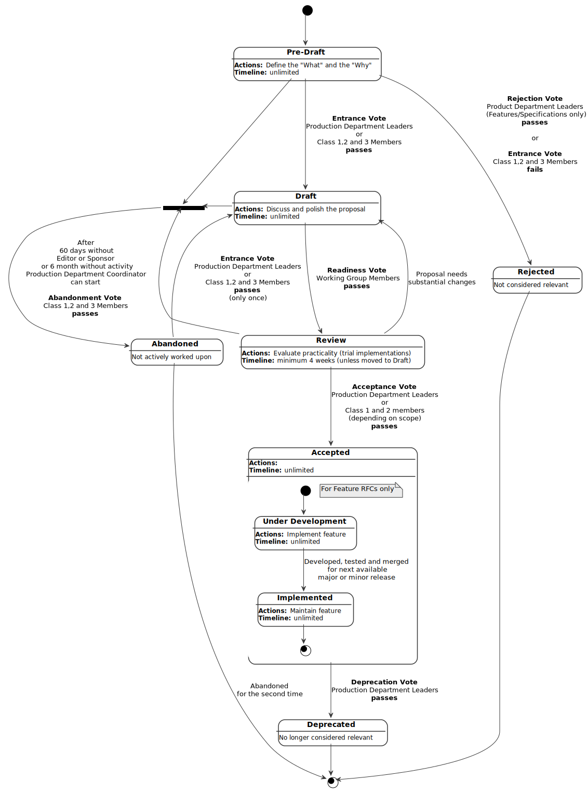

# Proposal Process Meta Document
*Accepted*

## 1. Summary

For a sustainable success of the Joomla project, **Processes**, **Features** and **Specifications** need to be well-thought
and generally accepted.
At the time of this writing (Jan 2020), the organisation does not have a defined process to ensure
this.

This proposal aims to define a way to enable everybody in the community to suggest processes, features or
specifications, and to define, how the community / project decides on the proposal.

## 2. Why Bother?

During the **Forum for the Future** event in January 2020, there was an overwhelming consensus about
the need to act more professional.

The project is encountering long-standing showstoppers for the release of Joomla 4.0, which could
have been avoided by a **think-first-then-implement** approach. An RfC (*Request for Comments*)
process is an appropriate tool to address this kind of problems, and will additionally increase the 
(not only the perceived) professionalism of the project. 

The main advantages of having an RfC procedure are

* **reduced number of issues**, because feature requests will be handled in the 
  RfC repository
* **less work for volunteers**, because they don't write code for the trash bin, which
  happens too often with the current approach ("show code, then we decide")
* **less useless discussion** about things already decided on, because the RfC process
  documents the decisions (why we do it this way, and also why we don't do it the other
  way)
* **open for non-developers**, because only the first two
  sections of the meta document (*Summary* and *Why Bother*) are needed to start the
  process
* **less maintenance**, because the RfC procedure leads to better maintainable code
* **improved communication**, because the process involves other departments
* **improved quality**, because the process ensures architectural suitable solutions

## 3. Scope

### 3.1 Goals

The goals for this proposal are to

* define how to propose specifications, features or processes
* define the possible states of a proposal
* define the workflow through those states
* define the decision process

### 3.2 Non-Goals

It is not the goal of this proposal to limit the ability of anybody to propose 
specifications, features or processes.

## 4. Approaches

The wording and structure for this proposal are heavily inspired
by the [PHP FIG][]. In fact, the README, workflow bylaw, voting protocol, and the 
RfC document structure were created from copies of the FIG original.

### 4.1 How to Propose Specifications, Features or Procedures

As a single point of truth, all proposals are managed in this repository 
(currently *joomla-x/joomla-standards*, which should be moved to a pinned repository 
*joomla/joomla-standards* or *joomla/rfc*, once this RfC is accepted).

In the `template/` directory of the repository, templates for the proposals are 
provided, so they will follow a certain structure. Having this structure allows 
to build user interfaces for users who are not familiar with GitHub, f.x. on a 
new version of the Ideas portal. Other / additional templates may be provided depending
on actual needs.

To get started, the two first paragraphs are most important:
* **1. Summary** to describe what the proposal is about, and
* **2. Why Bother** to describe why anybody should spend time on it.

The second paragraph is the point where also Marketing gets involved into the proposal, 
so they can tell, whether or not that proposal makes sense to our audience, and what is 
important from a non-technical point of view. In most cases, Marketing will rephrase 
that paragraph. 

### 4.2 Possible States of a Proposal

* #### Pre-Draft

    The goal of the Pre-Draft stage is to determine whether a majority of Joomla is
    interested in adding a Joomla **Feature**, publishing a Joomla **Specification**
    for a proposed concept or implementing a **Process** (like this RfC).
    For **Processes**, the RfC must state, if it purely technical, so the Acceptance vote
    is restricted to the Production Department, or not, in which case the Acceptance vote
    is conducted in all Departments.

* #### Draft

    The proposal (the "what") is accepted by the community and thus expresses the
    community's will. Moving the proposal to the Accepted state is now mandatory duty
    for the Leadership.
    The goal of the Draft stage is to discuss and polish a **Feature**, **Specification** or **Process** 
    proposal up to the point that it can be considered for review.
    
* #### Review
  
    The Review Phase is an opportunity for the community to experiment with a reasonably
    fixed target to evaluate a proposal's practicality.
    
* #### Accepted
      
    The proposal (the "how") is accepted by experts. If the Acceptance Vote passes, then the proposal officially becomes an **Accepted
    Feature / Specification / Process**.

* #### Deprecated

    A **Deprecated Specification / Feature / Process** is one that has been accepted, but is no longer 
    considered relevant or recommended. Typically this is due to the Specification / Feature / Process 
    being superseded by a new version, but that is not required.

* #### Implemented

    An **Implemented Feature** is one that has been developed, tested and merged for 
    the next available major or minor release. 

* #### Abandoned

    An **Abandoned Feature / Specification / Process** is one that is neither accepted nor actively being worked upon. 

### 4.3 Workflow through the States

The workflow is described in detail in a separate [Workflow Document][rfc-workflow].
The voting process is described in detail in a separate [Voting Document][rfc-voting].

In short:
- For **Entrance**, **Deprecation** and **Abandonment** all members of Open SourceMatters (Class 1, 2 or 3) can vote. The reason is that Entrance votes
  reflect the will of the community and should only be revertible (moved to
  Deprecation or Abandoned) by the community itself.
  
- For **Acceptance** all Team Leaders in the Production Department and the Production Department Coordinator can vote for **Features**, **Specifications** and purely technical **Processes**. The reason is that these items require
  technical expertise and only have impact on Production.
  All Team Leaders in all Departments and their Department Coordinator
  may vote on Acceptance measures for **Processes** that are not purely technical.

- For **Readiness** the Working Group conducts an internal vote.

This diagram gives an overview of the states and the transitions:

## 5. Design Decisions

* The RfC repository will be moved to `joomla/rfc`.
* The Feature Request template on GitHub will be modified to suit the process.
  Some automation may be added to it later. Also, a form may be provided for
  non-GitHub users (simplified Feature Request, maybe revival of the Ideas Portal)

## 6. People

### 6.1 Editor(s)

* Niels Braczek <niels.braczek@community.joomla.org>

### 6.2 Sponsors

* Marco Dings <marco.dings@community.joomla.org>

### 6.3 Contributors

* Wilco Alsemgeest <wilco.alsemgeest@community.joomla.org>
* Anibal Sanchez <anibal.sanchez@extensions.joomla.org>

## 7. Votes

* **Acceptance Vote:** PROD2020/032 Passed 2020-12-03.

## 8. Relevant Links

_**Note:** Order descending chronologically._

* [PHP FIG][]
* [Workflow Document][rfc-workflow]
* [Voting Document][rfc-voting]

[PHP FIG]: http://www.php-fig.org/
[rfc-workflow]: RFC-0-rfc-workflow.md
[rfc-voting]: RFC-0-rfc-voting.md

## 9. Errata

...
